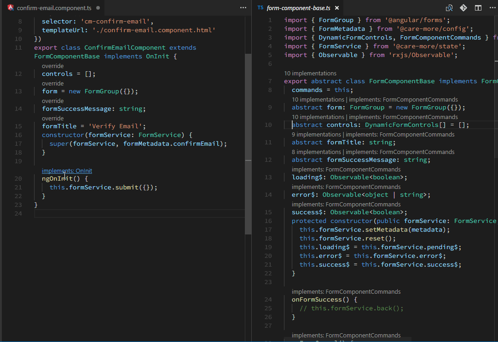

# ClassLens

ClassLens shows class's relationships with its interfaces and parent class in the form of CodeLens



I switch from WebStorm to vscode and find myself missing a feature miserably: the ability to see which members in a class are overrides to a base class and which members are interface implementations with a glance, plus the ability to navigate to the parent member quickly. Failing to find anything in the Marketplace, I finally developed this extension **ClassLens**, just to do what WebStorm does in in the form of CodeLens in vscode.

As the name implies, ClassLens marks the following members in an class in the form of Codelens, when vscode CodeLens is enabled:

1.  any class member that is an implementations of the class's interfaces.
2.  any class member that overrides base class' member.

ClassLens also allows you to quickly navigate to the parent member by clicking on the CodeLens. File will be opened side by side by default. You can change the behaviour by adding this configuration to `User Settings`:

```
"classLens.openSideBySide": false
```

# Limitations

1.  ClassLens does not support batch import, for example:

    ```
    import * as Layout from '@your-project/layout';

    export class ClassName extends Layout.BaseClass implements Layout.LayoutInterface {

    }
    ```

    I may fix this if there is high demand in the future.

1.  ClassLens supports namespaces partially. It supports class structures within the same namespace. It does not support extends/implements class/interfaces from other namespaces. The reason is vscode ignore these symbols when performing symbol lookups. And at the moment (1.23) vscode returns empty object arrays when look up for definitions for these symbols in the extension. I have not found a good solution yet.

1.  ClassLens also may not support multiple level of parent classes/interfaces i.e. parent class extending other class and interfaces extend other interfaces. I may fix this point if if there is high demand for it in the future.

# Non Codelens Alternative

If you prefer Codelens to be disabled for absolute tidiness, install **_Class IO_** instead. **_Class IO_** does the same thing but is not a codelens extension. It decorates members and provide definitions and a command to go to parent members.

# Performance

ClassLens is a TypeScript and JavaScript Codelens extension, it requires CodeLens to be enabled to be triggered.

When it comes to CodeLens extension, performance is a key issue because they influence each other.

ClassLens builds up a database alike cache as you develop your project. Therefore it will cost you hardly anything after it has seen all of your class structures.

Caches will be saved to workspace state and each time you open vscode, ClassLens will recover the cache from workspace state.

ClassLens does not go and index your codebase like WebStorm does.

If you find Codelens show up really slow in your vscode, consider checking your extensions and try to disable any extensions that implement Codelens one by one, and see if Codelens' showing up speed is up.

# Cache

To clean workspace cache:

CTRL/CMD + P: then search for "ClassLens: Clear Cache".

Note: Reset cache when ClassLens is updated and it is not working on files opened before.

# Support

Doesn't work or have a suggestion?

[Raise an issue](https://github.com/rexebin/classlens/issues)

[Submit a PR](https://github.com/rexebin/classlens/pulls)

Really enjoying ClassLens?

[Write a review](https://marketplace.visualstudio.com/items?itemName=rexebin.classlens#review-details)

In a giving mood?

[Donate](https://www.paypal.me/rexebin)

Your support is greatly appreciated!

# Links

[Github Repository](https://github.com/rexebin/classlens)

[Install ClassLens from VSCode Marketplace](https://marketplace.visualstudio.com/items?itemName=rexebin.classlens)
